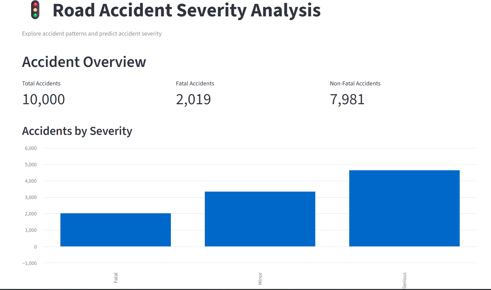

# Road Accident Severity Analysis

A machine learning and data analytics project that explores road accident patterns and predicts accident severity from selected accident-related factors.

## Live Dashboard

[Open the Streamlit Dashboard](https://roadaccidentseverityanalysis-3vzorqe4gtlgvxqjiepdsl.streamlit.app/)
## Dashboard Preview



## Project Overview

Road accidents can result in injuries and fatalities. This project uses Python, exploratory data analysis, statistical hypothesis testing, and Logistic Regression to study accident-related factors and demonstrate severity prediction through an interactive dashboard.

**Important:** The dataset used in this project is synthetically generated. The results demonstrate an analytical workflow and should not be interpreted as validated real-world road safety findings.

## Objectives

- Analyze road accident patterns and severity.
- Explore factors such as weather, lighting, road conditions, vehicle type, and accident cause.
- Perform exploratory data analysis (EDA).
- Use chi-square tests to examine associations between selected categorical variables and fatal outcomes.
- Train a Logistic Regression classification model.
- Present analysis and predictions in a Streamlit dashboard.

## Tech Stack

- Python
- Pandas and NumPy
- Matplotlib and Seaborn
- SciPy
- Scikit-learn
- Joblib
- Streamlit

## Dataset

The project dataset contains 10,000 synthetically generated accident records and 22 original columns. The dataset includes fields such as:

- Accident date and time
- State and district
- Road type and road condition
- Weather and lighting conditions
- Vehicle type and speed
- Alcohol involvement
- Helmet and seatbelt usage
- Driver age and gender
- Traffic density and accident cause
- Number of injuries and fatalities
- Accident severity

The model excludes direct outcome-related fields such as number of fatalities and number of injuries to reduce target leakage. Because the data is synthetic, model performance may not generalize to real accident data.

## Key Analysis Findings

In the generated dataset, the exploratory analysis found differences in fatal-outcome percentages across categories, including alcohol involvement, lighting conditions, accident causes, helmet use, and seatbelt use. Chi-square tests were used to examine statistical associations.

These are findings from the synthetic dataset, not evidence of causal effects or validated real-world risk estimates.

## Model Performance

The Logistic Regression model achieved the following results on the project's held-out test set:

| Metric | Result |
|---|---:|
| Accuracy | 96.95% |
| Fatal-class precision | 94% |
| Fatal-class recall | 91% |

These metrics apply only to the generated dataset and the particular train/test split used. They do not establish real-world predictive accuracy.

## Dashboard Features

- **Overview:** Summary of the accident dataset.
- **Accident Analysis:** Explore accident characteristics and patterns.
- **Severity Prediction:** Enter accident-related details to obtain a model prediction.

## Repository Files

| File | Description |
|---|---|
| `app.py` | Streamlit dashboard application |
| `requirements.txt` | Python package dependencies |
| `road_accident.csv.csv` | Synthetic accident dataset |
| `road_accident_model.joblib` | Trained Logistic Regression pipeline |

## Run Locally

### 1. Clone the repository

```bash
git clone https://github.com/bhuvana-mohan/Road_Accident_Severity_Analysis.git
cd Road_Accident_Severity_Analysis
```

### 2. Create a virtual environment

Windows PowerShell:

```powershell
python -m venv venv
.\venv\Scripts\Activate.ps1
```

### 3. Install dependencies

```bash
python -m pip install -r requirements.txt
```

### 4. Run the dashboard

```bash
python -m streamlit run app.py
```

The dashboard will open in your browser. Keep the dataset and model files in the same directory as `app.py`, unless the application code specifies different paths.

## Limitations

- The dataset is synthetic and may not represent real road accident distributions.
- Statistical associations do not prove causation.
- Model performance on synthetic data may be optimistic and should not be treated as real-world performance.
- Predictions are for educational demonstration only and should not be used for real-world safety or policy decisions without validation on suitable real data.

## Future Improvements

- Evaluate the model using real, reliable road accident data.
- Compare Logistic Regression with other classification algorithms.
- Add cross-validation and more detailed evaluation metrics.
- Improve class-imbalance analysis and model interpretability.
- Add dashboard filters and additional visualizations.

## Author

**Bhuvana M**

B.Tech — Artificial Intelligence and Data Science

## License

No license has been specified yet. Add a `LICENSE` file if you want to define how others may use, modify, and distribute this project.
